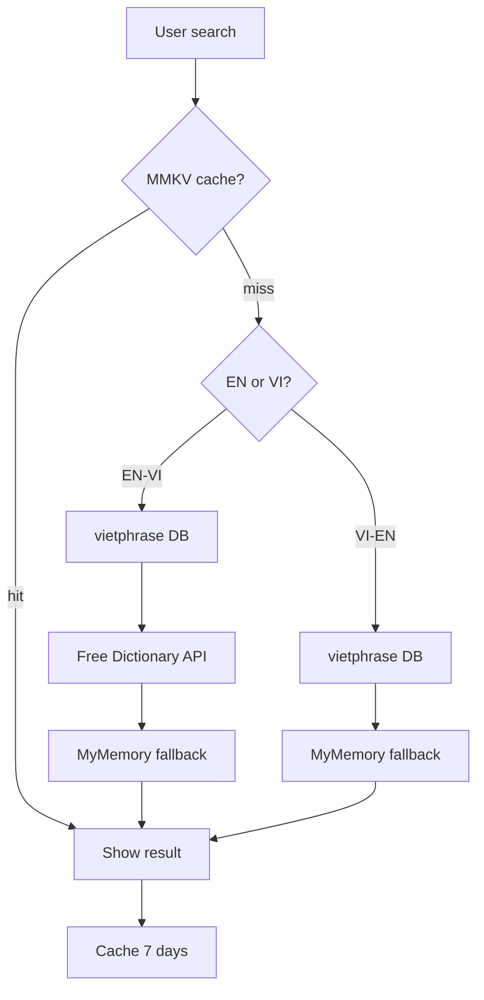

# Từ điển VocaBoost — API miễn phí

App **không cần trả phí** cho tra từ cơ bản. Ba nguồn được gộp trong `lib/dictionaryApi.ts`.

## 1. Free Dictionary API (tiếng Anh)

| | |
|---|---|
| URL | `https://api.dictionaryapi.dev/api/v2/entries/en/{word}` |
| Chi phí | Miễn phí, không cần API key |
| Cung cấp | IPA, định nghĩa EN, ví dụ, file MP3 phát âm |
| Hạn chế | **Không có** nghĩa tiếng Việt |

Ví dụ: `GET .../en/hospital`

## 2. MyMemory Translation (Anh ↔ Việt)

| | |
|---|---|
| URL | `https://api.mymemory.translated.net/get?q={text}&langpair=en\|vi` |
| Chi phí | Miễn phí ~1.000 từ/ngày/IP |
| Cung cấp | Dịch EN→VI và VI→EN |
| Tăng quota | Thêm email vào `.env`: `EXPO_PUBLIC_MYMEMORY_EMAIL=you@email.com` |

Đổi chiều: `langpair=vi|en`

## 3. Supabase `vietphrase` (dữ liệu của bạn)

| | |
|---|---|
| Nguồn | Bảng PostgreSQL trên Supabase |
| Chất lượng | Nhiều nghĩa, CEFR, chủ đề — tốt nhất cho app học từ |
| Setup | Chạy `supabase/seed-vietphrase.sql` (30 từ mẫu) |
| Mở rộng | Import [VietPhrase](https://github.com/vanthanhtran245/VietPhrase) |

## Thứ tự ưu tiên khi tra từ



## Gọi từ code

```typescript
import { searchDictionary, searchDictionaryMany } from '../lib/api';

// EN → VI (một kết quả)
const entry = await searchDictionary('hospital', 'en-vi');

// VI → EN (nhiều kết quả nếu có trong DB)
const list = await searchDictionaryMany('bệnh viện', 'vi-en', 5);
```

## Khi nào cần API trả phí?

| Nhu cầu | Gợi ý |
|---------|--------|
| Từ điển EN-VI chuyên nghiệp, SLA | Oxford API (trả phí) |
| Dịch chất lượng cao, volume lớn | Google Cloud Translation |
| Phát âm tự nhiên | ElevenLabs (Phase 3 — đã có trong roadmap) |

Với MVP, bộ ba miễn phí ở trên là đủ.

## Setup nhanh

1. Supabase → SQL Editor → chạy `schema.sql` rồi `seed-vietphrase.sql`
2. Điền `.env`: `EXPO_PUBLIC_SUPABASE_URL`, `EXPO_PUBLIC_SUPABASE_ANON_KEY`
3. (Tuỳ chọn) `EXPO_PUBLIC_MYMEMORY_EMAIL=email@cua-ban.com`
4. Mở tab **Từ điển** → thử: `hospital`, `bệnh viện`, `fever`
